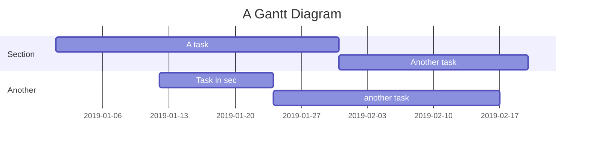
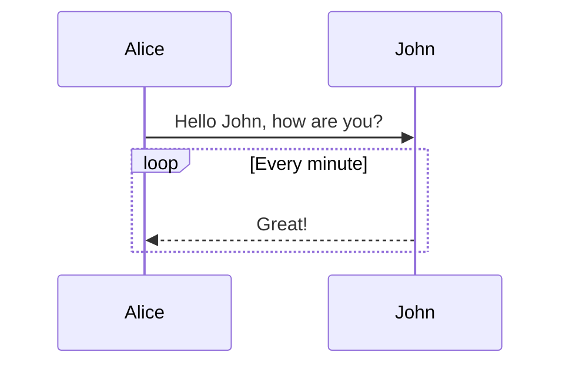
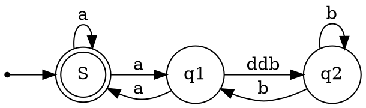
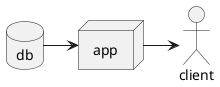

# h1 Heading

## h2 Heading

### h3 Heading

#### h4 Heading

##### h5 Heading

###### h6 Heading

## Horizontal Rules

---

## Emphasis

**This is bold text**

__This is bold text__

*This is italic text*

_This is italic text_

~~Strikethrough~~

## Blockquotes

> Blockquotes can also be nested...
>
>> ...by using additional greater-than signs right next to each other...
>>
>>> ...or with spaces between arrows.
>>>
>>

## Lists

Unordered

+ Create a list by starting a line with `+`, `-`, or `*`
+ Sub-lists are made by indenting 2 spaces:
  - Marker character change forces new list start:

    * Ac tristique libero volutpat at

    + Facilisis in pretium nisl aliquet

    - Nulla volutpat aliquam velit
+ Very easy!

Ordered

1. Lorem ipsum dolor sit amet
2. Consectetur adipiscing elit
3. Integer molestie lorem at massa
4. You can use sequential numbers...
5. ...or keep all the numbers as `1.`

Start numbering with offset:

57. foo
58. bar

## Code

Inline `code`

Indented code

```
// Some comments
line 1 of code
line 2 of code
line 3 of code
```

Block code "fences"

```
Sample text here...
```

Syntax highlighting

```js
var foo = function (bar) {
  return bar++;
};

console.log(foo(5));
```

## Tables


| Option | Description                                                               |
| -------- | --------------------------------------------------------------------------- |
| data   | path to data files to supply the data that will be passed into templates. |
| engine | engine to be used for processing templates. Handlebars is the default.    |
| et     | extension to be used for dest files.                                      |

Right aligned columns


| Option |                                                               Description |
| -------: | --------------------------------------------------------------------------: |
|   data | path to data files to supply the data that will be passed into templates. |
| engine |    engine to be used for processing templates. Handlebars is the default. |
|    ext |                                      extension to be used for dest files. |

## Links

[link text](https://github.com/shuzijun/markdown-editor)

## Images


## Emojies

😄 😆 😵 😭 😰 😅  😢 😤 😍 😌
👍 👎 💯 👏 🔔 🎁 ❓ 💣 ❤️ ☕️ 🌀 🙇 💋 🙏 💢

## Task

- [X] task 1
- [X] task 2
- [ ] task 3

## Hide details

<details>
<summary>Abstract</summary>
Here are the details.
</details>

## mathematical formulas

Multiline formula block：

$$
\frac{1}{
  \Bigl(\sqrt{\phi \sqrt{5}}-\phi\Bigr) e^{
  \frac25 \pi}} = 1+\frac{e^{-2\pi}} {1+\frac{e^{-4\pi}} {
    1+\frac{e^{-6\pi}}
    {1+\frac{e^{-8\pi}}{1+\cdots}}
  }
}

$$

Inline formula：

formula $a^2 + b^2 = \color{red}c^2$

## mind maps

```mindmap
- demo
- Heading
  - Emphasis
  - Blockquotes
  - Lists
  - Code
  - Tables
```

## Gantt charts



## timing charts



## charts

```echarts
{
  "title": { "text": "30 day" },
  "tooltip": { "trigger": "axis", "axisPointer": { "lineStyle": { "width": 0 } } },
  "legend": { "data": [ "user"] },
  "xAxis": [{
      "type": "category",
      "boundaryGap": false,
      "data": ["2019-05-08","2019-05-09","2019-05-10","2019-05-11","2019-05-12","2019-05-13","2019-05-14","2019-05-15","2019-05-16","2019-05-17","2019-05-18","2019-05-19","2019-05-20","2019-05-21","2019-05-22","2019-05-23","2019-05-24","2019-05-25","2019-05-26","2019-05-27","2019-05-28","2019-05-29","2019-05-30","2019-05-31","2019-06-01","2019-06-02","2019-06-03","2019-06-04","2019-06-05","2019-06-06","2019-06-07"],
      "axisTick": { "show": false },
      "axisLine": { "show": false }
  }],
  "yAxis": [{ "type": "value", "axisTick": { "show": false }, "axisLine": { "show": false }, "splitLine": { "lineStyle": { "color": "rgba(0, 0, 0, .38)", "type": "dashed" } } }],
  "series": [
    {
      "name": "user", "type": "line", "smooth": true, "itemStyle": { "color": "#f1e05a" }, "areaStyle": { "normal": {} }, "z": 2,
      "data": ["31","33","30","23","16","29","23","37","41","29","16","13","39","23","38","136","89","35","22","50","57","47","36","59","14","23","46","44","51","43","0"]
    }
  ]
}
```

## graphviz rendering



### Flowchart

```flowchart
st=>start: Start
op=>operation: Your Operation
cond=>condition: Yes or No?
e=>end

st->op->cond
cond(yes)->e
cond(no)->op
```

### plantuml


